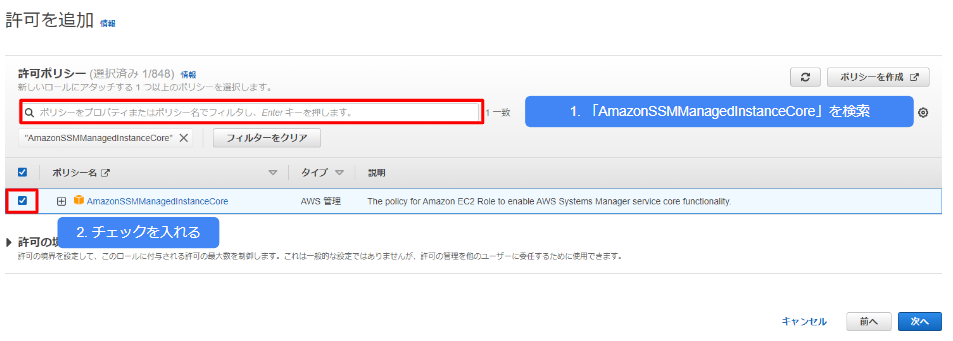
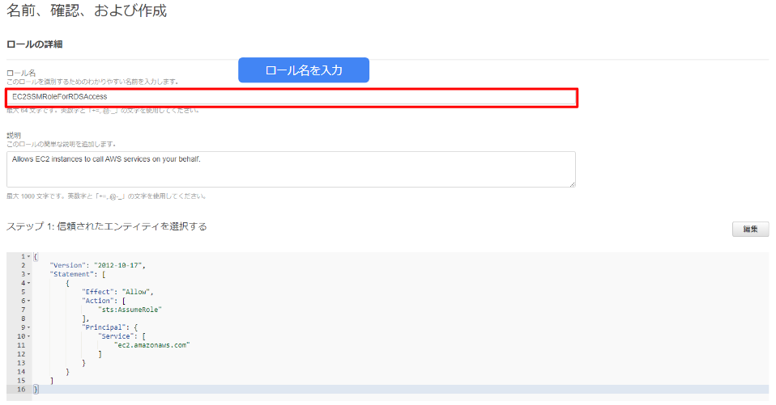
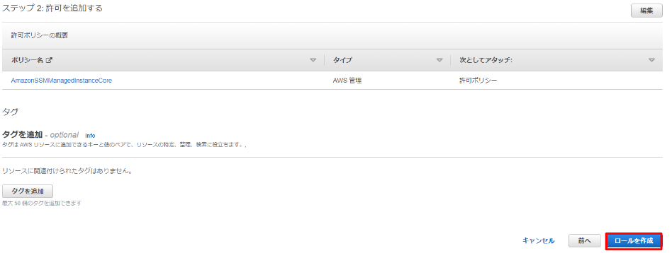
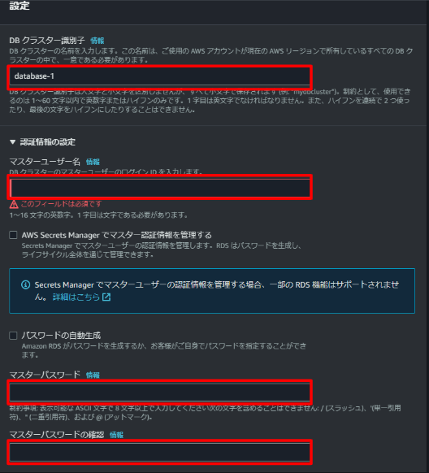
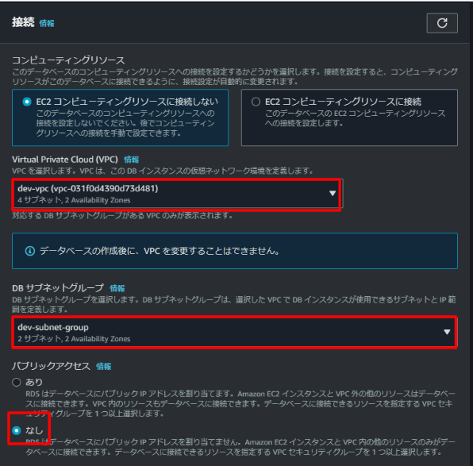

# DBeaverを使用してAmazon RDSへ接続
プライベートサブネットに構築したEC2インスタンス(踏み台経由)でDBeaverからAmazon RDSへ接続する方法について解説します。

本解説ではSession Managerを使ってSSH鍵を使用せず、プライベートサブネットのEC2インスタンスに接続します。

プライベートサブネットに配置したEC2へ接続するには、VPCエンドポイントが必要です。

VPCエンドポイントを使用することでプライベートな接続を確立することができます。

クライアントマシンからEC2インスタンスを介してリモートホストへのポートフォワーディングを使用し、Amazon RDSへのアクセスをします。


## DBeaverとは
---
DBeaverとはSQLを扱うためのクライアントツールです。<br>
[公式サイト](https://dbeaver.io/)では以下のように説明しています。

> 開発者、データベース管理者、アナリスト、およびデータベースを操作する必要があるすべての人のための無料のマルチプラットフォームデータベースツール。MySQL、PostgreSQL、SQLite、Oracle、DB2、SQL Server、Sybase、MS Access、Teradata、Firebird、Apache Hive、Phoenix、Prestoなどの一般的なすべてのデータベースをサポートします。

GUIでSQLを操作できることから学習用クライアントとしてだけでなく、現場での実践においても非常に優秀なツールです。

## DBeaverを使用してAmazon RDSへ接続するまでの流れ
---
全体の流れは以下の通りです。
- IAMロールを作成します
- EC2のセキュリティグループを作成します
- VPCエンドポイントのセキュリティグループを作成します
- VPCエンドポントを作成します
- Amazon RDS用のセキュリティグループを作成します
- Amazon RDSをプライベートサブネットに作成します
- クライアントマシンを設定します
- DBeaverをインストールします
- SSMリモートポートフォワーディングを使用し、DBeaverからテスト接続をします

## IAMロールを作成
---

1. ロールを選択します


2. ロールを作成します


3. 信頼されたエンティティタイプ: AWSサービスを選択します
    - ユースケース: EC2を選択し次へ


4. 許可ポリシーの検索から「AmazonSSMManagedInstanceCore」を検索し、チェックを入れ次へ



5. ロール名を入力します



6. ロールを作成をします



上記手順でSession Managerを使用してEC2インスタンスにアクセス許可するためのIAMロールが作成できます。
このIAMロールをEC2インスタンス作成時にアタッチします。

## EC2のセキュリティグループを作成
---
EC2のセキュリティグループはSession Manamgerを使用しEC2へアクセスするため、インバウンドルールは無しのものを作成します。

インバウンドルール: 

    - タイプ: なし
    - ソース: なし

アウトバウンドルールは全てのトラフィック0.0.0.0/0を許可(デフォルト)のままとします。

アウトバウンドルール: 

    - 全てのトラフィックを許可


## VPCエンドポイントのセキュリティグループを作成
---
VPCエンドポイントのセキュリティグループは以下のように作成します。

インバウンドルール: 

    - タイプ: HTTPS
    - ソース: VPC CIDR

このインバウンドルールを設定することで、VPCエンドポイントとの通信がHTTPSプロトコルを使用して暗号化され、データの安全性が向上します。

アウトバウンドルール: 

    - 全てのトラフィックを許可


## VPCエンドポイントの作成
---
プライベートサブネット内のEC2にSession Managerを利用するには、VPCエンドポイントを作成し、アクセスする必要があります。

以下の3つのVPCエンドポイントを作成します。
- com.amazonaws.ap-northeast-1.ssm
    - AWS Systems Manager (以下SSM) サービス全般で使用
- com.amazonaws.ap-northeast-1.ssmmessages
    - Session Managerで使用
- com.amazonaws.ap-northeast-1.ec2messages
    - SSMエージェントがSSMサービスを使用


VPCエンドポイントのセキュリティグループにはVPCセキュリティグループの作成時に作成したセキュリティグループを選択します。


## Amazon RDSのセキュリティグループを作成
---
RDS用のセキュリティグループを作成します。

EC2のセキュリティグループをインバウンドルールに設定することで、EC2のセキュリティグループに設定された対象のリソースからアクセスを許可することが可能です。

1. インバウンドルール: 
    - タイプ: MYSQL/Aurora
    - ソース: カスタム, EC2のセキュリティグループ
2. アウトバウンドルール: 
    - タイプ: すべてのトラフィック
    - 送信先: カスタム, 0.0.0.0/0

上記を設定し、セキュリティグループを作成します。


## Amazon RDSをプライベートサブネットに作成
---

1. エンジンのオプション: MySQLを選択


2. エンジンバージョン: デフォルトのまま


3. テンプレート: 開発/テスト環境を選択、もしくは料金が気になる方は無料利用枠を選択


4. 設定: 
    - DBインスタンス識別子: 任意の名前を入力(デフォルトのままでも問題ありません)
    - マスターユーザー名: 任意の名前を入力
    - マスターパスワード: 任意のパスワードを入力
    - マスターパスワードの確認: マスターパスワードと同様のものを入力



5. インスタンスの設定: 
    - DBインスタンスクラス: バースト可能クラス(t クラスを含む)
    - db.t2.microを選択


6. ストレージ: 
    - ストレージタイプ: 汎用SSD(gp2)
    - ストレージ割り当て: 20GiB
    - 最大ストレージしきい値: 1000Gib


7. 接続: 
    - コンピューティングリソース: EC2コンピューティングリソースに接続しない
    - パブリックアクセス: なしを選択
    - 追加設定: データベースポート3306




8. データベース認証: 
    - データベース認証オプション: パスワード認証


9. 追加設定: 
    - データベースの選択肢: 
    - 最初のデータベース名: 任意のデータベース名を入力
    - DBパラメータグループ: default.mysql8.0
    - オプショングループ: default.mysql8.0
    - バックアップ: 
        - 自動バックアップを有効にします: チェック
        - バックアップ保持期間: 7日間


上記以外の選択肢はデフォルトのままでとします。

これでデータベースの作成をクリックします。

## クライアントマシンの設定
---

事前準備としてSession Managerのプラグインをインストールします。
各OSによってインストール方法が異なります。
AWS公式ガイドに沿ってインストールをします。
https://docs.aws.amazon.com/ja_jp/systems-manager/latest/userguide/session-manager-working-with-install-plugin.html


WindowsOSの場合


MacOSの場合


インストール完了後、以下コマンドを実行し(Windowsの場合PowerShell、Macの場合ターミナル)、インストールが問題なく完了していることを確認します。

```
session-manager-plugin
```
以下のように表示されていればSession Managerのプラグインインストールは成功しています。
```
The Session Manager plugin was installed successfully. Use the AWS CLI to start a session.
```

### WindowsOS(Windows10)の場合の補足
WindowsOSの場合環境変数パスが設定されていないと、コマンドが通らないことがあります。
その場合には環境変数のパスを追加する必要があります。

#### 環境変数の追加方法
- 「スタート」メニューを右クリックし、「システム」を選択します

- 「システムの詳細設定」をクリックします


- 「環境変数」ボタンをクリックします


- 「システム変数」セクションで、Path変数を見つけて選択します

- 「編集」をクリックします


- C:\Program Files\Amazon\SessionManagerPlugin\bin\session-manager-plugin.exe を追加しOKします。(環境によってパスが異なる場合があります)


## Session Managerのポートフォワードを開始
---
WindowsOSの場合:

以下コマンドをPowerShellで実行します。

```PowerShell
aws ssm start-session `
  --target EC2インスタンスのインスタンスID `
  --document-name AWS-StartPortForwardingSessionToRemoteHost `
  --parameters '{\"portNumber\":[\"3306\"], \"localPortNumber\":[\"3306\"], \"host\":[\"RDSのエンドポイント\"]}'
```

MacOSの場合: 

以下コマンドをターミナルで実行します。

```Terminal
aws ssm start-session \
  --target i-EC2踏み台ホストのインスタンスID \
  --document-name AWS-StartPortForwardingSessionToRemoteHost \
  --parameters '{"portNumber":["3306"], "localPortNumber":["3306"], "host":["RDSのエンドポイント"]}'

```

以下のようなメッセージが表示されればポートフォワードを開始し、ローカルホストのポート3306をAmazon RDSのポート3306へ転送している状態で接続待ちになっています。
```
Starting session with SessionId: Administrator-03c193d64c5411884
Port 3306 opened for sessionId Administrator-03c193d64c5411884.
Waiting for connections...
```


## DBeaverのインストール
---
1. 以下リンクからDBeaverをダウンロードします。

https://dbeaver.io/download/

2. インストーラを起動しPlease select a language. は日本語を選択しOKをクリックします。


3. DBeaver Communityセットアップへようこそ画面: 次へをクリックします。


4. 使用許諾契約: 同意するをクリックします。


5. Choose Users: For me(user)を選択し、次へをクリックします。


6. 構成要素の選択: インストールする構成要素を選択: デフォルトのまま次へをクリックします。


7. インストール先の選択: 特に指定がなければ次へをクリックします。


8. スタートメニューのフォルダの選択: 特に指定がなければインストールをクリックします。


9. DBeaver Community セットアップの完了: 完了をクリックします。


## DBeaverを使用してAmazon RDSへ接続
---
それではいよいよDBeaverからAmazon RDSへ接続します。


1. DBeaverを起動します。
2. サンプルのデータベースを作成しますか？のメッセージが表示されますが、RDS作成時に最初のデータベース名で入力したデータベースが作成されているため、ここでは作成不要とし、いいえを選択します。


3. 新しい接続タイプを選択する画面でMySQLを選択し、次へをクリックします。


4. 接続先情報を入力します。
    - Server Host: localhost
    - Datebase: 空白
    - ユーザー名: RDS作成時に入力したマスターユーザー名入力
    - パスワード: RDS作成時に作成したマスターパスワードを入力


上記を設定したらテスト接続をクリックします。

接続が問題なく確立できれば、接続済みのメッセージが表示されます。
